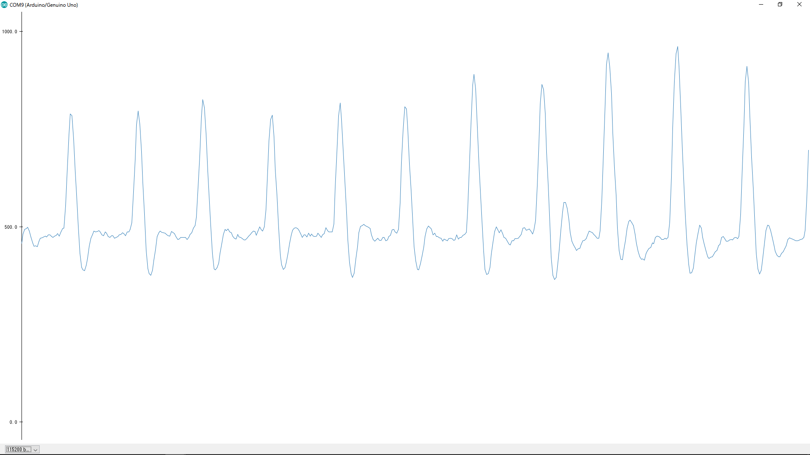

# Arduino-IlluminationPulseSensor
東舞鶴駅イルミネーション事業用プログラム(電気情報工学実験ⅡB)

*完成版のコミットまでにreadmeは整理してきれいにします* 

## 所感
* AVRの仕様書421ﾍﾟｰｼﾞってマジか…

---

## センサーについて
使用する脈拍センサーは[World Famous Electronics llc](http://pulsesensor.com/)のPulseSensorを用いる(直球なﾈｰﾐﾝｸﾞ)  
脈拍センサーを使用することで下図のような値が入力される。  
  

## 制御内容
### オブジェ1(angel,arrow)
* 7つの矢を飛ばすために、１周期ごとにフラグ(Pulse[Boolean])をセンサー側からオブジェ側へ送信する。なお、表示する矢は基本的に一本ずつ光らせる。パターンを以下に示す。
  1. センサーモード：光らせ方はすでに光っている一本を消して次の一本をつける場合
  2. スタンバイモード：消さずに一本ずつつける場合(7本光ったら一度すべて消す)
* エンジェルのハートは光らせるために、１周期ごとにフラグ(Pulse[Boolean])をセンサー側からオブジェ側へ送信する。
* 脈拍センサーに触れていない時は、スタンバイモードであらかじめプログラムしている点灯方法を用いる。

### オブジェ2(heart)
コードについては、[@luna01926](https://github.com/luna01926)の[lightingLED](https://github.com/luna01926/lightingLED)を参照

## 定義された変数について
### センサー側

Variable Name   | Type    |  description
----------------|---------|-----------------------
Signal          | Int     | AnalogInputで得た値。500Hz(2ms)ごとに更新される。
BPM             | Int     | 1分間あたりの脈拍値。
IBI             | Int     | 鼓動と鼓動のｲﾝﾀｰﾊﾞﾙの値。
Pulse           | Boolean | センサーが感知したらtrue,それ以外はfalseを返す
QS              | Boolean | BPMが更新されたりパルスが更新されるたびにtrueを返す。リセット時に使用する。

### オブジェ側  
**以下未確定のため編集領域として置いておく**  

Variable    | Type    | data | description
------------|---------|------|-----------------------
BPM         | Int     | 8bit | 1分間あたりの脈拍値。
Pulse       | Boolean | 1bit | センサーが感知したらtrue,それ以外はfalseを返す(フラグが立ったら送信されるのでいらない…)
ObjectID    | Int     | 1bit | Arduinoに対して割り振られたID、0 or 1
DetectedHand| Boolean | 1bit | 両方検知で1,それ以外は0
Mode        | Int     | 2bit | (代替としてモードを実装してるので実装してません)

## 送信データ仕様

* 送信データが2byteのためunsigned intを使う

bit       | 7 | 6 | 5 | 4 | 3 | 2 | 1 | 0
----------|------|------|------|------|------|-------|-------|-----
上位8bit  |      |      |      | DetectedHand | ObjectID | Mode1 | Mode0 | Pulse0
下位8bit  | BPM7 | BPM6 | BPM5 | BPM4 | BPM3 | BPM2 | BPM1 | BPM0

* Mode : ﾓｰﾄﾞを指定して送信する(内容は別途規定)  
* Pulse : センサーの反応値  
* BPM : ヒトの正常な脈拍の値が広いため8bitで送信  
* Object : センサーのArduino2台使用時に使用  
* DetectedHand : 手がもう一方のArduinoで検知されているかどうか判断
**残りは未使用の予約領域として残す**

## ピン番号  
### PulseSensor_0 & PulseSensor_1  
0. HardwareSerial Rx  <-  USB Serial  
1. HardwareSerial Tx  ->  USB Serial  
3. Timer2  
4. DetectedHand       <-  Other Arduino ModeUpdate Pin(8)
5. fadePin
6. OutSerial Rx       <-  [7,9]ZigBee Tx  
7. OutSerial Tx       ->  [6,8]ZigBee Rx  
8. ModeUpdate         ->  [3]DetectedHand && ZigBee ModeChanger  

### Angel  
0. HardwareSerial Rx  <-  USB Serial && [7]ZigBee Tx(Mode Change)  
1. HardwareSerial Tx  ->  USB Serial && [6]ZigBee Rx(Mode Change)  
2. Angel  
10. SignalSerial Rx   <-  [7]ZigBee Tx(Sensor Data)  
11. SignalSerial Tx   ->  [6]ZigBee Rx(Sensor Data)  
13. FlagCheck  

### Arrow  
0. HardwareSerial Rx  <-  USB Serial && [9]ZigBee Tx(Mode Change)  
1. HardwareSerial Tx  ->  USB Serial && [8]ZigBee Rx(Mode Change)  
2. Arrow #1  
3. Arrow #2  
4. Arrow #3  
5. Arrow #4  
6. Arrow #5  
7. Arrow #6  
8. Arrow #7  
10. SignalSerial Rx   <-  [7]ZigBee Tx(Sensor Data)  
11. SignalSerial Tx   ->  [6]ZigBee Rx(Sensor Data)  
13. FlagCheck  

## 無線子機
### 1(モード)  
6. AngelSerial Rx  <-  [1]HardwareSerial Tx  
7. AngelSerial Tx  ->  [0]HardwareSerial Rx  
8. ArrowSerial Rx  <-  [1]HardwareSerial Tx  
9. ArrowSerial Tx  ->  [0]HardwareSerial Rx  

### 4(Sensor Data Receiver)
6. SensorData Rx  <-  [11]SignalSerial Tx
7. SensorData Tx  ->  [10]SignalSerial Rx
8. SensorData Rx  <-  [11]SignalSerial Tx  
9. SensorData Tx  ->  [10]SignalSerial Rx

### 6(Sensor Data Transmitter)
3. INPUT Mode  <-  [8]ModeUpdate
6. SoftwareSerial Rx  <-  [7]PulseSensor_0 OutSerial Tx
7. SoftwareSerial Tx  ->  [6]PulseSensor_0 OutSerial Rx
8. SoftwareSerial Rx  <-  [7]PulseSensor_1 OutSerial Tx
9. SoftwareSerial Tx  ->  [6]PulseSensor_1 OutSerial Rx

## 主な仕様  
### センサー側  
センサーによる検知や処理はサンプルプログラムに依る  
受け取った値を解析してZigBeeの積んであるArduinoへ送信する  
センサーを2つ使うため、各Arduino間で検知を共有する  

### オブジェ側  
中継器に対してデータを送信する  
なお、オブジェ1、オブジェ2に対して受信用のZigBee on Arduinoを使う
そのため、オブジェ1のArduinoはSoftwareSerialを用いてangelとarrowに受信データの送信を行う  
無線班より受信したSoftwareSerialによる1byteのデータの内容によっては割り込みをする

---

## テストプログラム
Arduinoの実験用にこのﾘﾎﾟｼﾞﾄﾘで管理していたテストプログラム群は[このﾘﾎﾟｼﾞﾄﾘ](https://github.com/ShuftBK/Arduino-TestPrograms)に移動
